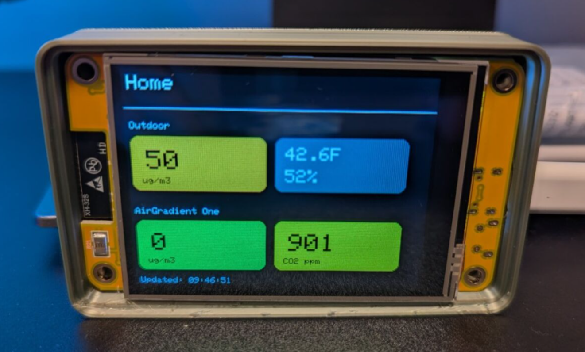

# AirGradient DIY Display — CYD Hardware Port

This repository contains a port of the AirGradient DIY Display firmware to the Cheap Yellow Display (CYD) hardware platform. It adapts the original AirGradient display code to run on the CYD board and provides PlatformIO project configuration so you can build and upload the firmware using Visual Studio Code.



## What this is

- A firmware build for the AirGradient DIY Display targeting the CYD hardware variant.
- PlatformIO project files and source sketches are included so you can build and flash from VS Code.

This project is intended for hobbyists and makers who want to run the AirGradient display code on CYD-compatible hardware. It assumes you have a CYD board and the required sensors and wiring for the AirGradient display.

## Requirements

- ESP32 based Cheap Yellow Display (CYD) such as [this one](https://www.aliexpress.us/item/3256804774970998.html?aff_fcid=833907b4e99a4b60b55ec4424b7768bb-1762221082683-09002-_DkSpIjB&tt=CPS_NORMAL&aff_fsk=_DkSpIjB&aff_platform=shareComponent-detail&sk=_DkSpIjB&aff_trace_key=833907b4e99a4b60b55ec4424b7768bb-1762221082683-09002-_DkSpIjB&terminal_id=a4a5de52b7ad4ef3ab00acde7041ad9b&afSmartRedirect=y&gatewayAdapt=glo2usa4itemAdapt) for ~$15
  - For more information, visit [https://github.com/witnessmenow/ESP32-Cheap-Yellow-Display](https://github.com/witnessmenow/ESP32-Cheap-Yellow-Display)
- USB cable compatible with your CYD board

### Optional

- Visual Studio Code
- PlatformIO extension for VS Code
- Arduino IDE

## Build and upload using VS Code + PlatformIO

1. Open this folder in Visual Studio Code. Use `File -> Open Folder...` and select the `mini_display_cyd` folder.
2. Install the PlatformIO extension if you haven't already. In VS Code, open the Extensions view and search for "PlatformIO IDE" and install it.
3. Confirm PlatformIO recognizes the project. The `platformio.ini` in this folder contains the build configuration for the CYD target. You should see PlatformIO status in the bottom bar of VS Code.
4. Build the firmware:

    ### VS Code with PlatformIO

      Click the Checkbox button at on the bottom bar of VSCode to build and upload
      or
      Use the PlatformIO GUI: open the PlatformIO sidebar, choose "Project Tasks > [environment name] > Build" then "Upload".

    ### Command line with PlatformIO

        ```powershell
        # From the terminal inside VS Code (PowerShell) run:
        platformio run
        ```

        Upload the firmware to your CYD board. First connect your board to USB and make sure the correct serial/USB port is available. Then run:

        ```powershell
        # Builds and uploads using the environment configured in platformio.ini
        platformio run --target upload
        ```

## Building and upload with Arduino IDE

1. Install latest Arduino IDE environment
1. Install ESP32 in Boards Manager
    - Tools>Boards>Boards Manager and install "esp32 by Espressif Systems". Tested with 2.0.17 and 3.3.3
1. Install required libraries from Sketch>Include Library>Manage Libraries
    - TFT_eSPI
    - XPT2046_Touchscreen
    - ArduinoJson
    - WiFiManager
1. Setup display
    - Copy User_Setup.h from this project folder into the `TFT_eSPI` folder in your Arduino libraries folder
    - See [https://randomnerdtutorials.com/cheap-yellow-display-esp32-2432s028r/](https://randomnerdtutorials.com/cheap-yellow-display-esp32-2432s028r/) for details under heading "Prepare User_Setup.h Config File for TFT_eSPI Library"
1. Configure board under Tools
    - Board: ESP32 Dev Module
    - CPU Frequency: 240MHz
    - Core Debug Level: None
    - Erase All Flash Before Sketch Upload: Disabled
    - Events Run On: "Core 1"
    - Flash Frequency: "80Mhz"
    - Flash Mode: "QIO"
    - Flash Size: "4MB (32Mb)"
    - Partition Scheme: "Minimal SPIFFS (1.9MB APP with OTA/190KB SPIFFS)"
    - Upload Speed: "921600"
1. Verify/Compile and Upload

## AirGradient Dashboard Configuration

Once the hardware is setup, additional configuration is needed in the AirGradient Dashboard site.

1. Navigate to the AirGradient Dashboard
2. Click on the Menu button>Hardware>Mini Displays or use link [https://app.airgradient.com/settings/hardware?tab=1](https://app.airgradient.com/settings/hardware?tab=1)
3. Click "Add New" and enter the MAC of the display in the `Display ID` field
4. Select which Indoor Location you want to have values shown on the display
5. Click Save

## Notes about serial port and board selections

- If your board requires a specific upload protocol or serial port definition, edit `platformio.ini` and set `upload_port` or the appropriate `board`/`platform` entries. See PlatformIO documentation for details.
- On Windows, the serial port will be like `COM3`, `COM4`, etc.

## Troubleshooting

- Build errors: ensure PlatformIO dependencies are installed (PlatformIO will attempt to download platforms and libraries automatically). If the build fails due to missing libraries, open the `platformio.ini` and check the `lib_deps` section.
- Upload errors: confirm the board is in the correct bootloader/upload mode (some boards require holding a button or resetting while the serial port is active). Also ensure no other program (like a serial monitor) is keeping the port open.
- If PlatformIO can't detect the board: verify the `board` field in `platformio.ini` matches a supported board, or set `upload_port` explicitly.

## Support me

[](https://ko-fi.com/O5O31C8PHG)

[](https://paypal.me/mallocarray)
